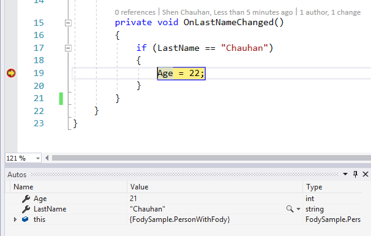

# Fody- INotifyPropertyChanged the easy way

INotifyPropertyChanged is chiseled into every XAML developers brain. It provides amazing data binding power, but it has one drawback for me - code bloat. Take for example the code below, it's a class with 3 properties: LastName, FirstName and Age. It's a pretty simple class but there is a lot of framework code detracting away from the simplicity.

```csharp
    public class PersonWithoutFody : INotifyPropertyChanged
    {
        public event PropertyChangedEventHandler PropertyChanged;

        private int _age;
        private string _firstName;
        private string _lastName;

        public string LastName
        {
            get { return _lastName; }
            set
            {
                _lastName = value;
                RaisePropertyChanged();
            }
        }


        public string FirstName
        {
            get { return _firstName; }
            set
            {
                _firstName = value;
                RaisePropertyChanged();
            }
        }


        public int Age
        {
            get { return _age; }
            set
            {
                _age = value;
                RaisePropertyChanged();
            }
        }

        private void RaisePropertyChanged([CallerMemberName]string propertyName = "")
        {
            this.PropertyChanged?.Invoke(this, new PropertyChangedEventArgs(propertyName));
        }
    }
```

What I would love is a simpler version which keeps my code true to what it was originally. That is where Fody comes in. The same code with Fody looks like this:

```csharp
    public class PersonWithFody : INotifyPropertyChanged
    {
        public event PropertyChangedEventHandler PropertyChanged;

        public int Age { get; set; }

        public string FirstName { get; set; }

        public string LastName { get; set; }
    }
```
The lines of code reduces dramatically and is clean from framework code! Under the hood Fody weaves the equivalence of what you see in the original file at compile time.

## Setting up Fody

Let's talk about how to set this up. There are 3 simple steps.

### 1.Nuget
The first step is to add the nuget package.

  

### 2.FodyWeavers.xml
Next up, you'll need to create a FodyWeavers.xml file and add it to your project. This helps link the code weaving to the compiler.

```xml
<?xml version="1.0" encoding="utf-8" ?>
<Weavers>
  <PropertyChanged/>
</Weavers>
```

### 3.Add INotifyPropertyChanged
Finally, I just need to make my sure my classes implement INotifyPropertyChanged like so:

```csharp 
public class PersonWithFody : INotifyPropertyChanged
```

And that's it!

## Some additional goodies!
Some of you will want to execute logic when the setter on the property is called. Fody has a neat way for you to intercept setter calls based on a naming convention. For instance, if I wanted to intercept the setter on LastName property I would write a method like so:

  

You can even subscribe globally for a PropertyChange on a class by specifying a method like:

  

in some cases, you may not want a property to notify, in which case you can opt-out by specifying an attribute:
```csharp
    [DoNotNotify]
    public string FirstName { get; set; }
```

Finally, sometimes you want one property to notify another property. For that you can use the attribute AlsoNotifyFor and then pass in the property name you want to notify like so:

```csharp
    [AlsoNotifyFor("LastName")]
    public string FirstName { get; set; }
```

I hope Fody helps you become more productive. To learn more checkout https://github.com/Fody/PropertyChanged

I've created a sample for you try out: http://www.github.com/shenchauhan/Fody

Happy coding!!